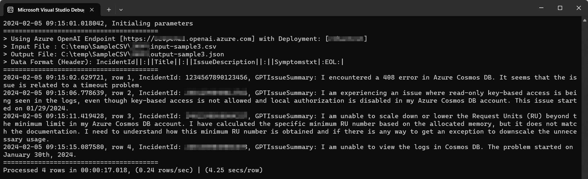

# Operate Mode: GPTSRSummary
Combining with OpenAI GPT, this program is designed to understand input SR Title and Description to summarize the SR is most relevant to which Skill Group.  
With the given restrict keywords for each Skill Groups (embedded in prompts), the program will cross check input context to identify the most relevant Skill Group and re-generate a copy of title, description based on the context.

## Step 1. Consider following sample KQL to extract required information from SRs

```
let Delimiter = '||:||';
let EndOfLine = '|:EOL:|';
AllCloudsSupportIncidentWithReferenceModelJitVNext
| limit 10
| extend outputCSV = strcat(IncidentId, Delimiter, Title, Delimiter, IssueDescription, Delimiter, Symptomstxt, EndOfLine)
| project outputCSV
```

## Step 2. Save the exported value [outputCSV] into local file (ex: input-sample.csv).
Ensure the format of each record is concat properly with specified "Delimiter" and "EndOfLine".
If there exist header of columns in the file, please specify **\{FileInputwithHeader : True\}** in the following step.
```
IncidentId||:||Title||:||IssueDescription||:||Symptomstxt|:EOL:|
1234567890123456||:||This is a sample title||:||encounter 408 in Cosmos DB||:||customer encountered 408|:EOL:|
```

## Step 3. Configure program parameters accordingly
Please ensure the value of **"Delimiter"** and **"EndOfLine"** parameters are aligned with Step 1 you used.
```
{
  "FilePath": "C:\\temp\\",
  "FileInputwithHeader": true,
  "FileInput": "input-sample.csv",
  "FileOutput": "output-sample.json",
  "Delimiter": "||:||",
  "EndOfLine": "|:EOL:|",
  "OpenAIEndpoint": "https://<EndPoint>.openai.azure.com",
  "OpenAIKey": "AccessKey",
  "OpenAIDeployname": "DeploymentName",
  "CompletionDelayMs": 3000 //preventing 429 - https://learn.microsoft.com/en-us/azure/ai-services/openai/quotas-limits
}
```

## Step 4. Customize prompt question to GPT based on your team requirements
### Sample 
>   
Considering the following described context is mainly a problem that happened in Microsoft Azure Cosmos DB and associated services, so most all terms, technology should be correlated and refer to Azure Services.  
If there is any Errors or Status Code in the following context, please reference to Cosmos DB HTTP Status code (https://learn.microsoft.com/en-us/rest/api/cosmos-db/http-status-codes-for-cosmosdb) to interpret issue.  
The \"Issue Title\" is '''___replaceWithTitle___''' and \"Issue Description\" provided by customer is following text '''___replaceWithIssueDescription___'''  
And the support engineer determined the \"Symptom\" is following text '''___replaceWithSymptomstxt___'''  
DO NOT refer to any information in the following summary include: \"Database name\", \"Collection name\" from both \"Issue Description\" and \"Symptom\".  
Remove any unknown part from summary.  
Please provide a straightforward summary to better describe the issue from given \"Issue Description\" and the \"Symptom\" above; ensure removing any personal contact information like name, email address, contact phone number AND account name, database name, container name to protect PRIVACY.  
The output Summary MUST use a first-person angle to describe the issue.  

## Reference & Demo
[input-sample.csv](SRSummary/resources/input-sample.csv)  
[output-sample.json](SRSummary/resources/output-sample.json)  
  

<hr>

# Operate Mode: GPTDOCAbstract

(tbd)
